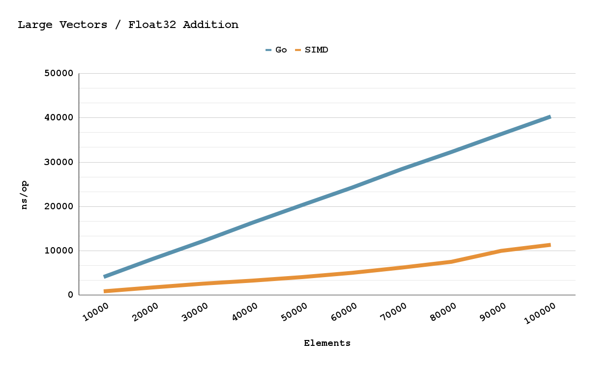
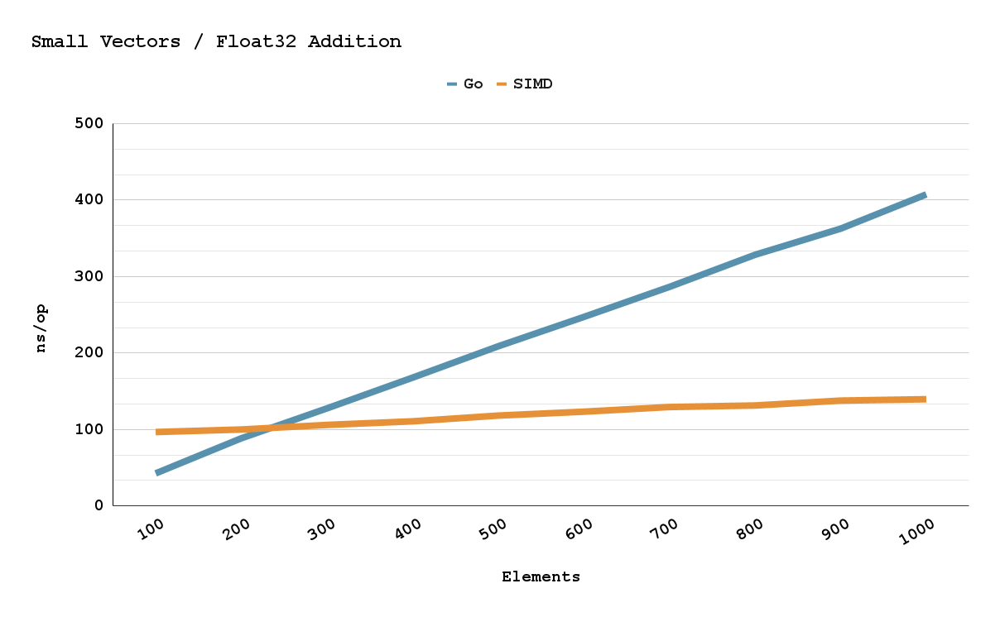

    </img>
    

    <h1 style="padding=5px">
        
    </h1>

`৻( •̀ᗜ •́ ৻) SIMD Go assembly` or parallel arithmetic bitwise machine instructions

𒇫 `ദ്ദി(˵•̀ᴗ -˵)ᕤ ++470% 📈` performance improvements

𒇫 `૮₍ • ᴥ • ₎ა` 32/64-bit x86/AMD64 support

𒇫 `(๑ᵔ⤙ᵔ๑)` ARM64 support in the making 

## `Σ(°△°)ꪱꪱ` Documentation ♨

𒇫 [docs/](docs/docs.md)

𒇫 pkg.go [pkg.go.dev/github.com/pehringer/simd](https://pkg.go.dev/github.com/pehringer/simd)

## `ദ്ദി(༎ຶ‿༎ຶ)` AMD64 Simd Support 
|          |SSE      |SSE2     |SSE4.1   |AVX      |AVX2     |
|----------|---------|---------|---------|---------|---------|
|AddFloat32|x|         |         |x|         |
|AddFloat64|         |x|         |x|         |
|AddInt32  |         |x|         |         |x|
|AddInt64  |         |x|         |         |x|
|AndInt32  |         |x|         |         |x|
|AndInt64  |         |x|         |         |x|
|DivFloat32|x|         |         |x|         |
|DivFloat64|         |x|         |x|         |
|DivInt32  |         |         |         |         |         |
|DivInt64  |         |         |         |         |         |
|MulFloat32|x|         |         |x|         |
|MulFloat64|         |x|         |x|         |
|MulInt32  |         |         |x|         |x|
|MulInt64  |         |         |         |         |         |
|OrInt32   |         |x|         |         |x|
|OrInt64   |         |x|         |         |x|
|SubFloat32|x|         |         |x|         |
|SubFloat64|         |x|         |x|         |
|SubInt32  |         |x|         |         |x|
|SubInt64  |         |x|         |         |x|
|XorInt32  |         |x|         |         |x|
|XorInt64  |         |x|         |         |x|

(<a href="#top">🔝</a>)

## `(๑•̀ᗝ•́)૭` AMD64 Performance 📶

  

(<a href="#top">🔝</a>)
