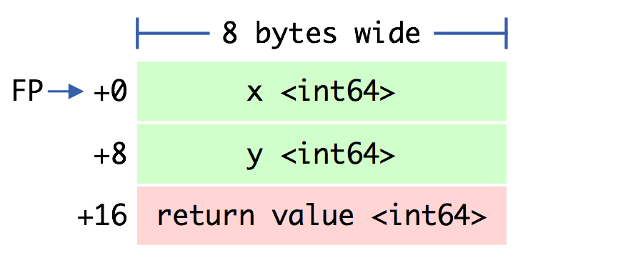

## TODO
- https://github.com/anonymouse64/asm2go
- https://github.com/klauspost/asmfmt
- https://github.com/minio/asm2plan9s
- https://github.com/minio/highwayhash/blob/master/highwayhash_arm64.go
@anonymouse64 - I really appreciate you getting back to me, even in the negative!
In the end, I used disarm.pro to assemble the NEON opcodes into hex words which I then can use with GAS via the WORD directive.

## Tools

>> [minio asm2plan9 - generate BYTE sequences for Go assembly](https://github.com/minio/asm2plan9s)

## Go assembly knowledge base

>> [Intro to Go asm](https://go.dev/doc/asm)

>> [Understanding the Go compiler](https://www.youtube.com/watch?v=qnmoAA0WRgE)

>> [Go stack primer](https://docs.google.com/document/d/1wAaf1rYoM4S4gtnPh0zOlGzWtrZFQ5suE8qr2sD8uWQ/pub)

>> [Stack handling in Go](https://blog.cloudflare.com/how-stacks-are-handled-in-go/)

>> [Go ABI specification](https://github.com/golang/go/blob/49d42128fd8594c172162961ead19ac95e247d24/src/cmd/compile/abi-internal.md)

>> [Primer on GO assembly ](https://cmc.gitbook.io/go-internals/chapter-i-go-assembly)

>> [Foray Into GO assembler ](https://blog.sgmansfield.com/2017/04/a-foray-into-go-assembly-programming/)

>> [High performance scaling techniques in Go](https://www.youtube.com/watch?v=HdDOnJKyjhc)

>> [From slow to SIMD: A Go optimization story](https://sourcegraph.com/blog/slow-to-simd)

>> [SimD Optimizations in Go](https://goroutines.com/asm)

>> [Accelerating SHA256 by 100x in Golang on ARM](https://blog.min.io/accelerating-sha256-by-100x-in-golang-on-arm/)

## Reference

>> [Plan 9 assembly manual](https://9p.io/sys/doc/asm.pdf)
>> [NEON vs SSE](https://blog.yiningkarlli.com/2021/09/neon-vs-sse.html)

>> [x86 anames](https://github.com/golang/go/blob/release-branch.go1.5/src/cmd/internal/obj/x86/anames.go)
>> [Intel x86 instruction set](https://www.felixcloutier.com/x86/index.html)
>> [Intel x64 Instruction set](https://www.intel.com/content/www/us/en/docs/intrinsics-guide/index.html)
>> [x86-64 stack frame layout](https://eli.thegreenplace.net/2011/09/06/stack-frame-layout-on-x86-64)

>> [AVX Instruction set](https://gist.github.com/alexcrichton/3281adb58af7f465cebee49759ae3164)
>> [AVX 512 Go support](https://go.dev/wiki/AVX512)
>> [Go AVX512 test data](https://github.com/golang/go/tree/master/src/cmd/asm/internal/asm/testdata/avx512enc)
>> [Go sneller AVX512](https://github.com/SnellerInc/sneller)

>> [ARM64 Instruction set](https://dougallj.github.io/asil/)
>> [ARM64 Go support](https://pkg.go.dev/cmd/internal/obj/arm64)
>> [Go ARM64 test data](https://github.com/golang/go/blob/master/src/cmd/asm/internal/asm/testdata/arm64enc.s)
>> [MacOS SysCalls](https://github.com/opensource-apple/xnu/blob/master/bsd/kern/syscalls.master)

| 386 | amd64 | arm | arm64 | mips64 | ppc64 | s390x |
| --- | --- | --- | --- | --- | --- | --- |
|1-byte | MOVB | MOVB | - | - | - | - |
|1-byte | sign extend | MOVBLSX | MOVBQSX | MOVBS | MOVB | MOVB | MOVB | MOVB |
|1-byte | zero extend | MOVBLZX | MOVBQZX | MOVBU | MOVBU | MOVBU | MOVBZ | MOVBZ |
|2-byte | MOVW | MOVH | - | - | - | - |
|2-byte | sign extend | MOVWLSX | MOVWQSX | MOVHS | MOVH | MOVH | MOVH | MOVH |
|2-byte | zero extend | MOVWLZX | MOVWQZX | MOVHU | MOVHU | MOVHU | MOVHZ | MOVHZ |
|4-byte | MOVL | MOVW | - | - | - | - |
|4-byte | sign extend | - | MOVLQSX | - | MOVW | MOVW | MOVW | MOVW |
|4-byte | zero extend | - | MOVLQZX | - | MOVWU | MOVWU | MOVWZ | MOVWZ |
|8-byte | - | MOVQ | - | MOVD | MOVV | MOVD | MOVD |
[Golang UK 2016 - Michael Munday - Go Functions in Assembly](https://www.youtube.com/watch?v=9jpnFmJr2PE)

### Baby steps:
to learn how a Go file is compiled we can take a look at the generated GoASM with `go tool build -S <file.go>`
Symbols are defined in the textflax header file, so including `#include textflag.h` is a damn good idea writing GoASM

### Flags:
    - NOSPLIT don't insert stack check (limit stack size)

    - use leaf functions only (unless large stack is needed)

    - NOFRAME don't alloc stack frame (functions must be leafs only)

    - func must be declared with stack frame size of 0 `TEXT <package·function(SB)>,NOFRAME,$0-<argument-size>`

    - NO POINTERS ANYWHERE

| Go ASM | YASM x64 | NASM x86 | ARM (+64) |
| --- | --- | --- | --- |
| AX | rax | eax | R1 |
| BX | rbx | ebx | R2 |
| CX | rcx | ecx | R3 |

full set of register symbols available depends on architecture

### Pseudo Registers:

    - FP (Frame Pointer):
        - virtual frame pointer to refer to func arguments
        - offsets are positive eg: arg+0(FP)
        - first_arg+0(FP) is the first argument
        - second_arg+8(FP) is the second on a 64-bit machine
        - go vet checks that argument names and offsets match

    - SB (Static Base):
        - can be thought of as the origin of memory
        - foo(SB) is the name foo as an address in memory
        - foo+4(SB) is four bytes past the start of foo

    - SP (Stack Pointer):
        - virtual stack pointer used to refer to frame-local variables and the args being prepared for func call
        - points to highest address in local stack frame so
        - offsets are negative eg: x-8(SP), y-4(SP)
        - x-8(SP) and -8(SP) are different memory locations and
        second refers to the hardware's SP register
        - positive offsets also refer to hardware registers on 386/amd64

    - PC (Program Counter):
        - used for branching
        - offsets in number of pseudo-instructions

All user-defined symbols are written as offsets to the pseudo-registers FP (arguments and locals) and SB (globals)

### General purpose registers 
    - named R0 through R31
    - float registers F0 through F31
    - address registers A0...
    - coprocessor registers 

### Registers are caller saved or trashed except:

    - SP
    - FP
    - Zero register (if any)
    - G context pointer register (if any)

### Data moves from left to right !!!

    ADD R1, R2 => R2 += R1
    SUB R3, R4, R5 => R5 = R4 - R3
    MUL $7, R6 => R6 *= 7

### Arguments are passed in reverse-order
first is the closest to the top of the stack

    0x0008 ADDL CX, AX
    0x000a MOVL AX, "".~r2+16(SP)
    0x000e MOVB $1, "".~r3+20(SP)

ADDL adds two Long-words (4-byte values) from AX and CX, then stores the result in AX and moves it over to "".~r2+16(SP), where caller has reserved stack space and expects to find the ret values

### WARNING: stack access is costly in code size and execution speed. Keep number of params to less than five if possible!

### Mem operands: offset + reg1 + reg2*scale

    MOV (R1), R2 => R2 = *R1
    MOV 8(R3), R4 => R4 = *(8 + R3)
    MOV 15(R5)(R6*1), R7 => R7 = *(16 + R5 + R6*1)
    MOV ·myvar(SB), R8 => R8 = *myvar

### Mem Addresses:

    MOV $8(R1)(R2*1), R3 => R3 = 8 + R1 + R2
    MOV $·myvar(SB), R4 => R4 = &myvar


### Addressing modes:

    - 16(R1): The location at R1 + 16
    - (R1): Alias for 0(R1)
    - R0->16
    - R0>>16
    - R0<<16
    - R0@>16: same as 32-bit ARM
    - (R2)(R0): The location at R0 plus R2
    - $(8<<12): Left shift the immediate value 8 by 12 bits
    - (R5, R6): Register pair for LDAXP/LDP/LDXP/STLXP/STP/STP

### Branching

Branches and direct jumps are always written as offsets to the PC, or as jumps to labels. Labels are private members.

    label:
        MOVW $0, R1
        JMP label

### Define package-level data
    DATA math·pi+0(SB)/8,$3
    GLOBL math·pi(SB),RODATA,$8

### Passing string arg - [HackerCat's intro to GO assembly](https://blog.hackercat.ninja/2018/quick_intro_to_go_assembly/)
Use `RODATA` symbol to store data on the global stack (private data is appended with `<>`)

    DATA  foo<>+0x00(SB)/8, $"My rando"
    DATA  foo<>+0x08(SB)/8, $"m string"
    DATA  foo<>+0x16(SB)/1, $0x0a
    GLOBL foo<>(SB), RODATA, $24

    TEXT ·helloWorld(SB), NOSPLIT, $0
        MOVL 	$(0x2000000+4), AX 	// syscall write
        MOVQ 	$1, DI 			// arg 1 fd
        LEAQ 	foo<>(SB), SI 		// arg 2 buf
        MOVL 	$24, DX 		// arg 3 count
        SYSCALL
        RET

NOTE: can't define string in one go, needs to be chunks of 8 bytes (64 bits)

#### i386

    - registers SP, AX, BX, CX, DX, BP, DI, and SI
    - AX is the return register
    - runtime pointer to g is maintained through the MMU
    - include go_tls.h, defines OS-/arch-dependent macro for accessing the register
    - takes one arg (register to load the g pointer into)

For example, the sequence to load g and m using CX is:

    #include "go_tls.h"
    #include "go_asm.h"
    ...
    get_tls(CX)
    MOVL	g(CX), AX     // Move g into AX.
    MOVL	g_m(AX), BX   // Move g.m into BX.

NOTE: avoid CX except between memory references because -dynlink or -shared modes will overwrite it

##### Addressing modes:

    - 32-bit systems, distinguish low and high of 64-bit values by adding arg_lo+0(FP) or arg_hi+4(FP)

    - (DI)(BX*2): The location at address DI plus BX*2
    - accepted are 1, 2, 4, and 8 as scale factors only

#### AMD64

    - RSP (SP) grows down is always aligned to 8 bytes
    - MMX registers are M0 to M7
    - XMM registers are X0 to X15
    - amd64 does not use a link register
    - L for long word (32-bit)
    - PL for packed long (32-bit)
    - Q for quad word (64-bit)
    - O or DQ for oct word (128-bit)
    - integer arg registers:
        RAX, RBX, RCX, RDI, RSI, R8, R9, R10, R11
    - X0 – X14 for float args and results
    - R12 and R13 are permanent scratch registers
    - R15 is a scratch register except in dll's
    - AX holds return value
    - Float results are returned in X0
    - X15 holds the zero value
    - BP is callee-save. Assembler automatically inserts BP save/restore when frame size is larger than zero
    - code to access m and g pointers on 64-bit is same as on 32-bit, except use MOVQ rather than MOVL:

    MOVQ	g(CX), AX     // Move g into AX.
    MOVQ	g_m(AX), BX   // Move g.m into BX.

#### ARM [ASM is EZ](https://www.youtube.com/watch?v=vhyettT7sdA)
    - asm provides access to R0 through R14 and the PC
    - coprocessor registers C0 through C15
    - R10 and R11 reserved by compiler and linker
    - R10 points to the g (goroutine) structure
        (in asm, ptr must be g; R10 is not recognized)
    - R11 used for pseudo-operations like DIV or MOD with the R11 register commonly used as temporary value store
    - R13 is the SP
    - Floating registers are F0 through F7, FPSR and FPCR
    - when defining a TEXT, specifying frame size $-4 tells the linker to be a leaf function so no need to save LR on entry

##### Addressing modes:
    - CMP, ADD, SUB, MUL, and DIV, all with F or D suffix selecting single or double precision. 
    - MOVW for load or store word, and MOVM for load or store multiple
    - Floating-point load or store become MΧVF and MΧVD. Conversion instructions are also specified by moves:
        MOVWD, MOVWF, MOVDW, MOVWD, MOVFD, and MOVDF
    - IA (increment after), .IB (increment before), .DA (decrement after), and .DB (decrement before)
    - instruction can have suffix marking it conditional (ADD.EQ, ADD.NE)
    - Multiple codes chainable: MOVM.IA.W 
        (order of code modifiers is irrelevant)
    - MCR and MRC coprocessor instructions largely as in manual
    - R0->16
    - R0>>16
    - R0<<16
    - R0@>R1 left shift R0 by the count in R1
    - R0@>16 left shift R0 by 16 bits
    - other codes: 
        -> (arithmetic right shift)
        >> (logical right shift)
        @> (rotate right)
    - [R0,g,R12-R15] multi-register instructions
        (set comprising R0, g, and R12 to R15)
    - (R5, R6) Destination register pair

#### ARM64
    - RSP (SP) grows down is always aligned to 16 bytes
    - R0 – R15 for integer arguments and results
    - F0 – F15 for floating-point arguments and results
    - R16 and R17 permanent scratch registers
    - R18 (platform register) reserved
    - R27 and R28 reserved by compiler and linker
    - R29 (FP) 
    - R30 is the link register and:
        holds the func ret address at func entry
    - On entry, func subtracts from RSP to open stack frame, and saves val of R30 & R29 at bottom of frame
    - R30 is saved at 0(RSP) and R29 is saved at -8(RSP)
    - leaf func that does not require stack space may omit R30 and R29
    - ZR holds the zero value
    - only modifiers allowed: 
            P (postincr) and W (preincr) 
    - MOVW.P, MOVW.W (excluding plain MOVD)
    - alias JMP => B for Branch / CALL => BL for Link

| Register | Call meaning | Return meaning | Body meaning |
| --- | --- | --- | --- |
| RSP | Stack pointer | Same | Same |
| R30 | Link register | Same | Scratch (non-leaf functions) |
| R29 | Frame pointer | Same | Same |
| R28 | Current goroutine | Same | Same |
| R27 | Scratch | Scratch | Scratch |
| R26 | Closure context pointer | Scratch | Scratch |
| R18 | Reserved (not used) | Same | Same |
| ZR  | Zero value | Same | Same |

| Flag | Bit | Value | Meaning |
| --- | --- | --- | --- |
| DN  | 25 | 0 | Propagate NaN operands |
| FZ  | 24 | 0 | Do not flush to zero |
| RC  | 23/22 | 0 (RN) | Round to nearest, choose even if tied |
| IDE | 15 | 0 | Denormal operations trap disabled |
| IXE | 12 | 0 | Inexact trap disabled |
| UFE | 11 | 0 | Underflow trap disabled |
| OFE | 10 | 0 | Overflow trap disabled |
| DZE | 9 | 0 | Divide-by-zero trap disabled |
| IOE | 8 | 0 | Invalid operations trap disabled |
| NEP | 2 | 0 | Scalar operations do not affect higher elements in vector registers |
| AH  | 1 | 0 | No alternate handling of de-normal inputs |
| FIZ | 0 | 0 | Do not zero de-normals |

NOTE: Use Plan9's $ prefix for immediates  ` ADD     $4, R6 ` instead of ARM's #  `ADD     R6, R6, #4`
 

### MacOS syscalls
arguments are passed to the syscall with the registers: DI, SI, DX, R10, R8 and R9, the syscall code is stored in AX

    ;; #define SYSCALL_CLASS_NONE	0	/* Invalid */
    ;; #define SYSCALL_CLASS_MACH	1	/* Mach */	
    ;; #define SYSCALL_CLASS_UNIX	2	/* Unix/BSD */
    ;; #define SYSCALL_CLASS_MDEP	3	/* Machine-dependent */
    ;; #define SYSCALL_CLASS_DIAG	4	/* Diagnostics */

    MOVL 	$1,  DI 		    ;; arg 1 fd (stdout)
    LEAQ 	CX,  SI 		    ;; arg 2 buf
    MOVL 	$16, DX 		    ;; arg 3 count
    MOVL 	$(0x2000000+4), AX 	;; syscall write
    SYSCALL

### Recap:

    𒇫 Declare global function symbol "".add (actually main.add once linked)

    𒇫 OMIT stack-split preamble NOSPLIT as it is default

    𒇫 0 bytes of stack-frame, 16 bytes of arguments passed in
    
```
TEXT ·add(SB),$0
    MOVQ x+0(FP), BX    ;; load var x at address +0(FP) into register BX
    MOVQ y+8(FP), BP    ;; load var y at address +8(FP) into register BP
    ADDQ BP, BX         ;; adds BP to BX storing the result in BX
    MOVQ BX, ret+16(FP) ;; copies BX to address +16(FP) and returns
    RET

;; func add(a, b int32) (int32, bool)
0x0000 TEXT	"".add(SB), $0-16
  ;; ...omitted FUNCDATA stuff...
  0x0000 MOVL	"".b+12(SP), AX	    ;; move second Long-word (4B) argument from caller's stack-frame into AX
  0x0004 MOVL	"".a+8(SP), CX	    ;; move first Long-word (4B) argument from caller's stack-frame into CX
  0x0008 ADDL	CX, AX		        ;; compute AX=CX+AX
  0x000a MOVL	AX, "".~r2+16(SP)   ;; move addition result (AX) into caller's stack-frame
  0x000e MOVB	$1, "".~r3+20(SP)   ;; move `true` boolean (constant) into caller's stack-frame
  0x0013 RET			            ;; jump to return address stored at 0(SP)]

   |    +-------------------------+ <-- 32(SP)              
   |    |                         |                         
 G |    |                         |                         
 R |    |                         |                         
 O |    | main.main's saved       |                         
 W |    |     frame-pointer (BP)  |                         
 S |    |-------------------------| <-- 24(SP)              
   |    |      [alignment]        |                         
 D |    | "".~r3 (bool) = 1/true  | <-- 21(SP)              
 O |    |-------------------------| <-- 20(SP)              
 W |    |                         |                         
 N |    | "".~r2 (int32) = 42     |                         
 W |    |-------------------------| <-- 16(SP)              
 A |    |                         |                         
 R |    | "".b (int32) = 32       |                         
 D |    |-------------------------| <-- 12(SP)              
 S |    |                         |                         
   |    | "".a (int32) = 10       |                         
   |    |-------------------------| <-- 8(SP)               
   |    |                         |                         
   |    |                         |                         
   |    |                         |                         
 \ | /  | return address to       |                         
  \|/   |     main.main + 0x30    |                         
   -    +-------------------------+ <-- 0(SP) (TOP OF STACK)
```
[Go assembly primer](https://github.com/teh-cmc/go-internals/blob/master/chapter1_assembly_primer/README.md#dissecting-add)

### Special instructions:
    - PCALIGN pseudo-instruction indicates that the next instruction should be aligned to a specified boundary by padding with no-op (arm64, amd64)

For example, align the start of MOVD to 32 bytes:

    PCALIGN $32
    MOVD $2, R0

### Missing instructions:

There are two ways to go about missing instructions. One is to update the assembler to support that instruction, which is straightforward but only worthwhile if the instruction can be re-used. Alternatively, we can use the BYTE and WORD directives to lay down explicit data into an instruction:

- [minio example arm64 directives](https://github.com/minio/sha256-simd/blob/master/sha256block_arm64.s)

    // AHHHR R2, R3, R1 => R1 = R2 + R3 (high bits only)

    // WORD (32 bits)
    WORD $0xB9C83012

    // BYTE (8 bits)
    BYTE $0xB9; BYTE $0xC8
    BYTE $0x30; BYTE $0x12


